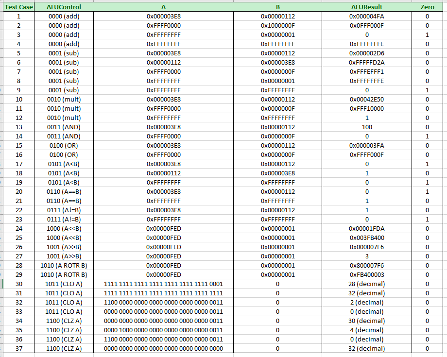
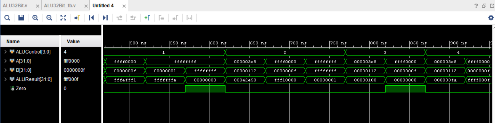
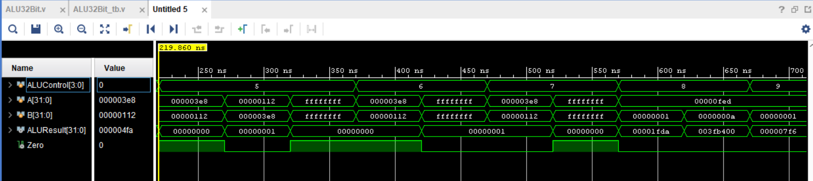
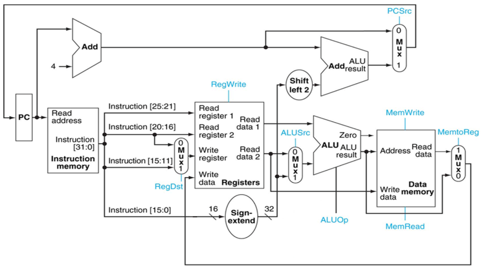

# 32bit_Datapath_Controller
32-bit processor with Datapath and Controller designed to support various operations.


<h1> Latest Adjustments </h1>
<ul>

  <li> 10/27/2018 - Modify and implement logic for Mux32Bit2to1, PCAdder, and ProgramCounter Modules. Testbenches included for all of them with their respecitve waveforms produced (Behavioral and Post-Synthesis) included in their folders. </li>
  <li> 10/28/2018 - Modify and implement logic for Sign Extension Module. Testbench ran and verified with included waveforms produced (Behavioral and Post-Synthesis Simulations). </li>
  <li> 11/01/2018 - Implement 32-Bit ALU Logic for various arithmetic operations including: </li>
  <ul>
    <li> ADD/SUB/MULT </li>
    <li> AND/OR </li>
    <li> A&ltB, A==B, A!=B </li>
    <li> Bitwise Shifting: A&lt&ltB, A&gt&gtB </li>
    <li> Bitwise Right Rotation A ROTR B </li>
  </ul>
  <li> 11/09/2018 - Updated ALU32Bit Module and TestBench to include all test cases provided in specifications. The following ALU32Bit Modules were updated: </li>
  <ul>
    <li> MULT </li>
    <li> A << B </li>
    <li> A >> B </li>
    <li> A ROTR B </li>
    <li> CLO </li>
    <li> CLZ </li>
  </ul>
  <li> 11/09/2018 - Implemented TestBench for InstructionMemory and DataMemory Modules with their Post-Synthesis Simulation waveforms included in their respective folders. </li>
  <li> 11/10/2018 - Updated ALU Module to convert from Non-Blocking to Blocking Notation to ensure immediate response for the output Zero. Documented Task0 showcasing all modules implemented with their respective logic and Post-Synthesis Simulation Waveforms matching the specifications. </li>
  <li> 11/13/2018 - Created Task 1 Pre-Lab Documentation with included PDF of pre-lab assignment (i.e, filling out tables of each control signal across the datapath design and modifying the datapath to accomodate ShiftLeft and ShiftRight modules). </li>
  <li> 11/16/2018 - Created Datpath and Controller Verilog design files describing the respective circuits. Testbench to be implemented and tested next. </li>
  <li> 11/18/2018 - Created testbench and used to troubleshoot implementation of Controller (controller.v) and TopLevel code (circuitMother.v). Controller and Datapath code still under adjustments to ensure correct behavior. </li>
  <li> 11/19/2018 - Updated circuitMother and MUX32Bit2to1 modules. Updated logic of Mux to include the parameters inA and inB into the sensitivity list. Updated specific in and out signals from various components of the datapath to ensure valid connections throughout the circuit. </li>
  <li> 11/20/208 - Update RegisterFile, Controller, and Datapath files to achieve the expected behavior of the Behavioral Simulation. Output values from Register are still a W.I.P. </li>
  <li> 11/21/2018 - Finalize Datapath and Controller Implementation for Behavioral Simulation to match the expected behavior. </li>
  <li> 11/21/2018 - Finalize all updated Modules (Datapath, Controller, RegFile) to support deb register implementation for Post-Synthesis Functional Simulation data monitoring. </li>

</ul>

<br>

<h1> Task0 - DataPath Components Implementation </h1>
<p> Eight DataPath Components implemented including: 32-Bit 2x1 Multiplexor, PCAdder, Program Counter, Sign Extension, 32x32 Register File, 32-Bit ALU with 13 supported operations, Instruction Memory, and Data Memory. </p>

<h3> 32-Bit 2x1 Mux Module </h3>
<ul>
  <li> The mux takes two 32-Bit inputs and based on the selector (sel) input, will allow either inA or inB to pass through:
    
``` Verilog
      
always @ (sel, inA, inB) begin
  if (sel)
     out <= inA;
  else
     out <= inB;
end
      
```
      
  
  </li>
  <li> Behavioral and Post-Synthesis Functional Simulations yeilded the following waveform: </li>
  <br>
</ul>
  
  
  
<br>
<br>

  
  
<h3> PCAdder Module </h3>
<ul>
   <li> A hardwired Adder that adds 4 to the input PCResult and sets that outcome to the output PCAddResult </li>
   <li> Behavioral and Post-Synthesis Functional Simulations yeilded the following waveform: </li>
   <br>
</ul>
  


<br>
<br>


<h3> Program Counter Module </h3>
<ul>
   <li> A Counter that at each Posedge of the Clk, will assign the output PCResult to either all 0's or the 32-Bit input Address, depending if Reset is active. </li>
   <li> Behavioral and Post-Synthesis Functional Simulations yeilded the following waveform: </li>
   <br>
</ul>
  


<br>
<br>


<h3> Sign Extension Module </h3>
<ul>
   <li> Module that analyzes the most significant bit and extends the value if necessary depending on the value of the MSB. If the MSB is 0, it will extend the input, in, from 16-bits to 32-bits by creating a new output and assign [15:0] to the current values of in and populate the values of bits [31:16] with all 0's. On the other hand, if MSB is 1, it will create a new output and assign [15:0] to the current values of in and populate the values of bits [31:16] with all 1's. </li>
  
```Verilog
assign out = {{16{in[15]}}, in};
```
   <li> Behavioral and Post-Synthesis Functional Simulations yeilded the following waveform(s): </li>
   <br>
</ul>
  
  
  
  
  <br>
  <br>
  
  
<h3> 32x32 Register File Module </h3>
<ul>
   <li> 32x32 Register file that contains two read ports and one write port. I/O is as follows </li>
      <ul>
        <li> (Input) ReadRegister1: 5-Bit address to select a register to be read through 32-Bit output port 'ReadRegister1'. </li>
        <li> (Input) ReadRegister2: 5-Bit address to select a register to be read through 32-Bit output port 'ReadRegister2'  </li>
        <li> (Input) WriteRegister: 5-Bit address to select a register to be written through 32-Bit input port 'WriteRegister' </li>
        <li> (Input) WriteData: 32-Bit write input port </li>
        <li> (Input) RegWrite: 1-Bit control input signal </li>
        <li> (Output) ReadData1: 32_bit Registered Output </li>
        <li> (Output) ReadData2: 32-Bit Registered Output </li>
     </ul>
  <li> Functionality: 'ReadRegister1' and 'ReadRegister2' are two 5-bit addresses to read two registers simultaneously. The two datasets are available on poprts 'ReadData1' and 'ReadData2' which are registered outputs (output of register file is written into these registers at the falling edge of the Clk). 
  <br>
  'RegWrite' signal is high during the rising edge of the clock if the input data is to be written into the register file. The contents of the register specified by the address 'WriteRegister' in the register file are modified at the rising edge of the Clk if 'RegWrite' signal is high. Note that the D-FF in the register file are Posedge triggered. </li>
</ul>
  
  
```Verilog
// Write Procedure
always @ (posedge Clk) begin
  if (RegWrite == 1) begin
    R_Addr[WriteRegister] <= WriteData;
  end
end

// Read Procedure 
always @ (negedge Clk) begin
  ReadData1 <= R_Addr[ReadRegister1];
  ReadData2 <= R_Addr[ReadRegister2];
end
```
   <li> Behavioral and Post-Synthesis Functional Simulations yeilded the following waveform(s): </li>
   <br>
</ul>
  
  
  
  
  
  
  
  <br>
  <br>
  
  
  
  
  <h3> 32-Bit ALU Module that supports 13 operations documented below. </h3>
  <p> *NOTE: Each operation is triggered using a 4-Bit ALU Control input and completes operation on 32-bit inputs A & B. Outputs ALUResult and Zero store the result of each operation and if the outcome is equal to zero respectively. </p>
  
  <li> Basic Arithmetic Operations: ADD (0000), SUBTRACT (0001), MULTIPLY (0010): </li>
  <p> These are the basic arithmetic operations the ALU supports that was achieved with the following equations and Zero assignment after ALUResult has been calculated. 
  
  ```Verilog
  
  ALUResult = A + B; // Add
  ALUResult = A - B; // Sub
  ALUResult = A * B; // Multiply
  if (ALUResult == 0) // Assign zero if necessary
    Zero = 1;
    
  ```
  </p>
  <li> Logical Operations: AND (0011), OR (0100): </li>
  <p> These operations were implemented using the logical operater syntax of & and | respectively. 
  
  ```Verilog
  ALUResult = A & B; // AND
  ALUResult = A | B; // OR
  if (ALUResult == 0) // Assign zero if necessary
    Zero = 1;
  ```
  </p>
  
  <li> Boolean Operations: LESS THAN (0101), SET EQUAL TO (0110), SET NOT EQUAL TO (0111): </li>
  <p> These Boolean Operations will result in an outcome of either 1 or 0 depending on if the comparison evaluates to true or false. 
  
  ```Verilog
  // LESS THAN
  if (A < B) begin
    ALUResult = 32'h00000001;
    Zero = 0;
  end
  else begin
    ALUResult = 32'h00000000;
    Zero = 1;
  end
  
  // Same logic for the other two operations, but using == and != instead. 
  ```
  </p>
  
  
  <li> Bit Shifting and Rotations: SHIFT LEFT (1000), SHIFT RIGHT (1001), ROTATE RIGHT (1010): </li>
  <p> These operations will Shift the input A by B number of Bits. The following equations were used for each individual operation:
  
  ```Verilog
  ALUResult = A << B; // LEFT SHIFT
  ALUResult = A >> B; // RIGHT SHIFT
  ALUResult = ((A >> B) | (A << (32 - B))); // A ROTR B
  if (ALUResult == 0)
    Zero = 1;
  ```
  </p>
  
  
  <li> Counting Ones and Zeros Operations: </li>
  <p> CLO and CLZ operations count the number of leading Ones and Zeros in the 32-bit input A. Achieves this by using a for loop that iterates starting from MSB, 31 and decrements down to 0, incrementing a counter variable, COUNT, when a 0 or 1 is detected respectively. At each iteration, a check is made that both the current index is greater than 0 AND that the current value at that index is not the opposite value that it is counting. (EX. if counting the leading ones and a ZERO is detected, the for loop with not iterate further and assign the ALUResult to the current COUNT value).
  
  ```Verilog
  // COUNT ONES - CLO
  for (index = 31; index >= 0 && A[index] != 0; index = index - 1)
    count = count + 1;
  ALUResult = count;
  if (ALUResult == 0)
    Zero = 1;
    
  // COUNT ZEROS - CLZ
  for (index = 31; index >= 0 && A[index] != 1; index = index - 1)
    count = count + 1;
  ALUResult = count;
  if (ALUResult == 0)
    Zero = 1;
  ```
  </p>
  
  <p> The following table was calculated by hand and used as the result verification for the TestBench created to test the ALU Implementation. </p>
  
  
  
   <li> Behavioral and Post-Synthesis Functional Simulations yeilded the following waveform(s): </li>
  
  
   <br>
</ul>

  <p> Test Cases 1-6: </p>
  
  <p> Test Cases 7-16: </p>
  
  <p> Test Cases 17-26: </p>
  
  <p> Test Cases 27-29: </p>
  
  <p> Test Cases 30-37: </p>
  


<br>
<br>


<h3> Instruction Memory Module </h3>
<ul>
   <li> This module is used to keep the machine language (binary sequence of instructions that we want the processor to execute). </li>
   <li> Behavioral and Post-Synthesis Functional Simulations yeilded the following waveform: </li>
   <br>
</ul>
  


<br>
<br>


<h3> Data Memory Module </h3>
<ul>
   <li> This module is used ot keep the result from ALU. </li>
   <li> Behavioral and Post-Synthesis Functional Simulations yeilded the following waveform: </li>
   <br>
</ul>
  


<br>
<br>


<h1> Task1 - Datapath and Controller Implementation </h1>
<p> This task involved writing the Verilog code to describe the Datapath and Controller for the 32-Bit Processor. The original circuit provided to use was the following  </p>

<h3> Original Circuit Design - Datapath and Controller </h3>




<h3> Understanding the Requirements </h3>
<p> The first portion of this Task was understanding how to manage the bits from the Instruction module so they are correctly assigned to their respective ports. The following table was provided stating which bit sections of the 32-Bit Instruction would be used for various inputs/operations. </p>


<h3> Modifying Circuit Design </h3>

<p> In order to handle the operation of ShiftLeft and ShiftRight, a few modifications were necessary to ensure the ability to pass the correct input values to their respective modules. This included adding two additional 32-Bit 2to1 Muxes that are included in the diagram shown below. The first Mux with control signal RegA was used to ensure that the input A of ALU can also come from Reg[rt] [20:16] in addition to Reg[rs] [25:21]. The second Mux that was added with control signal RegB allowed input B of the ALU to come from the shamt portion of the Instruction (i.e. Instruction[10:6]). </p>


<p> With these modifications complete, we were now ready to convert the circuit into Verilog Code. </p>


<h3> Controller Implementation </h3>

<p> The Datapath shown above services as the hub that accepts two 6-bit input values (op and func) and outputs all required control signals and ALUOp code based on the values given from op and func. Op and func are parsed from the Instruction with their respective bits as follows:
  

```Verilog

op <= Instruction[31:26]
func <= Instruction[5:0]

```
  
These input values then distinguish the control signals used across the various modules using an always block structured as follows:

```Verilog
always @ (op, func) begin

  // Add operation
  if ((op == 6'b00000) && (func == 6'b100000)) begin
    RegDst <= 1; RegWrite <= 1; 
    ALUSrc <= 0; MemRead <= 0; MemWrite <= 0;
    MemtoReg <= 1; PCSrc <= 0; RegA <= 0; RegB <= 0;
    ALUOp <= 4'd0;
  end
  
  // Subtract operation
  else if
    .
    .
    .
  end
  
  .
  .
  .
  
end
  
```
  
Each if-else block corresponds to the operations that the 32-Bit Processor supports in the notes from Task0. Each control source is given a binary value depending on what value is required to be passed through each module. ALUOp is also adjusted to give the ALU the instruction of which operation it needs to process on inputs A and B.
</p>
  
  
  
  

<h3> Datapath Implementation </h3>

<p> Using the modules created in Task0 of this project, we created a Top Level code that instantiated each individual module with the necessary inputs and outputs that wired the entire datapath as specified with the modifications made. An addition made to the Verilog File is the debug marking ability to monitor the output values of specific registers. This is to ensure the behavior of the circuit follows the expected output from the specifications. After implementing the debug registers, the Behavioral and Post-Synthesis Functional Simulations yeilded the following output </p>


